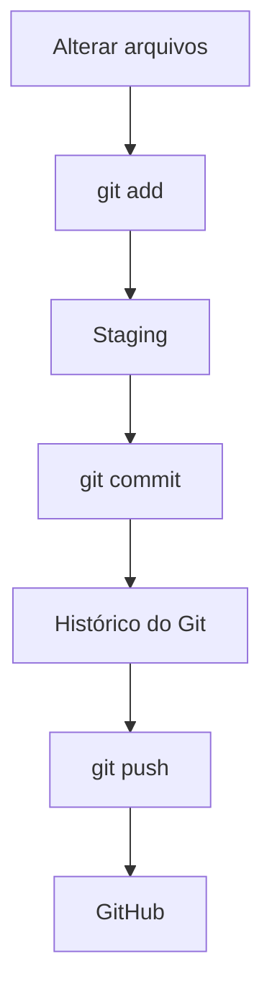

# `git add`

Após realizar alguma **alteração, criação, edição ou exclusão** de arquivos no projeto, é necessário adicionar essas mudanças à área de *staging* antes de criar um `commit`.

O comando `git add` **não salva definitivamente a alteração no histórico**. Ele apenas seleciona quais mudanças farão parte do próximo `commit`.

### Adicionar todas as alterações

Para adicionar todas as alterações do diretório atual:

```bash
git add .
```

Esse comando adiciona ao *staging* as alterações de arquivos **novos, modificados e removidos** dentro do diretório atual.

### Adicionar um arquivo específico

Você também pode escolher exatamente quais arquivos deseja adicionar:

```bash
git add README.md
```

Nesse caso, somente o `README.md` será colocado no *staging*.

Isso é útil quando você deseja criar um `commit` contendo apenas uma parte das alterações realizadas.

### Exemplo

Imagine que você tenha feito alterações em três arquivos:

```text
README.md
index.html
style.css
```

Você pode adicionar somente o `README.md`:

```bash
git add README.md
```

E depois criar o `commit`:

```bash
git commit -m "Atualiza documentação"
```

O `index.html` e o `style.css` continuarão com suas alterações **fora do staging**, aguardando o próximo `git add`.

### Fluxo básico



> **Resumo:** `git add` prepara as alterações que você deseja incluir no próximo `commit`.
