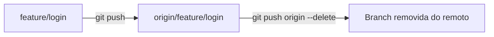
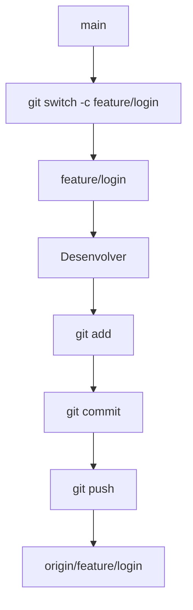
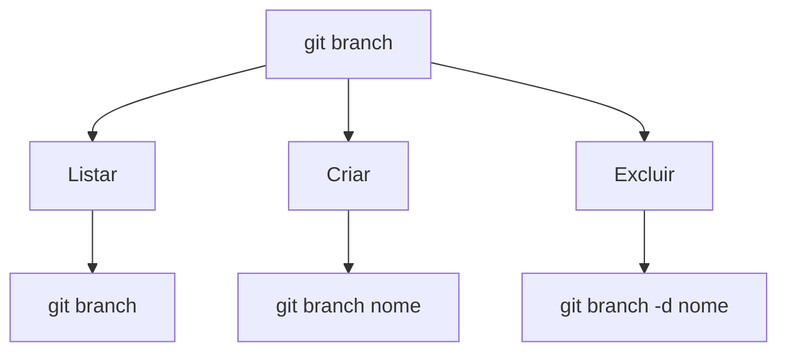

# `git branch`

O comando `git branch` é utilizado para **criar, listar, renomear e excluir branches** no Git.

Uma *branch* representa uma linha independente de desenvolvimento. Ela permite trabalhar em uma funcionalidade ou correção sem alterar diretamente outra branch.

## 1. Listar branches

Para visualizar as branches locais:

```bash
git branch
```

Exemplo:

```text
* main
  develop
  feature/login
```

O `*` indica a **branch em que você está atualmente**.

Para visualizar também as branches remotas:

```bash
git branch -a
```

Exemplo:

```text
* main
  develop
  remotes/origin/main
  remotes/origin/develop
```

---

## 2. Criar uma branch

Para criar uma nova branch:

```bash
git branch feature/login
```

Isso **cria a branch, mas não muda você para ela**.

Por exemplo:

```text
main
  │
  └── feature/login
```

Se quiser criar **e já trocar para a nova branch**, utilize:

```bash
git switch -c feature/login
```

---

## 3. Trocar de branch

O `git branch` não é o comando recomendado para trocar de branch.

Use:

```bash
git switch feature/login
```

Assim:

```text
Antes:

* main
  feature/login

Depois:

  main
* feature/login
```

---

## 4. Renomear uma branch

Para renomear a branch atual:

```bash
git branch -m novo-nome
```

Por exemplo, estando na branch `master`:

```bash
git branch -m main
```

Para renomear uma branch específica:

```bash
git branch -m nome-antigo nome-novo
```

---

## 5. Excluir uma branch

Para excluir uma branch local:

```bash
git branch -d feature/login
```

A opção `-d` solicita uma exclusão segura. O Git normalmente impede a remoção caso existam alterações que ainda não tenham sido integradas.

Se você realmente quiser forçar a exclusão:

```bash
git branch -D feature/login
```

⚠️ Use `-D` com cuidado, pois você pode excluir uma branch que ainda possui commits não integrados.

---

## 6. Branch local × branch remota

É importante diferenciar:

```text
💻 main
```

de:

```text
🌐 origin/main
```

A primeira é a **branch local**.

A segunda é uma **referência à branch `main` do repositório remoto `origin`**.

Por exemplo:

```bash
git branch
```

mostra branches locais:

```text
* main
  develop
```

Enquanto:

```bash
git branch -r
```

mostra branches remotas:

```text
origin/main
origin/develop
```

E:

```bash
git branch -a
```

mostra ambas.

---

## 7. Excluir uma branch remota

O `git branch -d` remove apenas uma branch **local**.

Para excluir uma branch do GitHub:

```bash
git push origin --delete feature/login
```

Fluxo:



---

## 8. Fluxo de branches

Um fluxo comum de desenvolvimento pode ser:



Depois que a funcionalidade estiver pronta, ela pode ser integrada à `main`, normalmente através de um **Pull Request** no GitHub.

---

## Principais comandos

| Comando                   | Função                               |
| ------------------------- | ------------------------------------ |
| `git branch`              | Lista branches locais                |
| `git branch -a`           | Lista branches locais e remotas      |
| `git branch -r`           | Lista branches remotas               |
| `git branch nome`         | Cria uma branch                      |
| `git branch -m novo-nome` | Renomeia a branch atual              |
| `git branch -d nome`      | Exclui uma branch local              |
| `git branch -D nome`      | Força a exclusão de uma branch local |
| `git switch nome`         | Troca para uma branch                |
| `git switch -c nome`      | Cria e troca para uma branch         |

### Resumo



> **Resumo:** `git branch` é o comando usado principalmente para **gerenciar branches**. Para trocar entre elas, prefira `git switch`.
