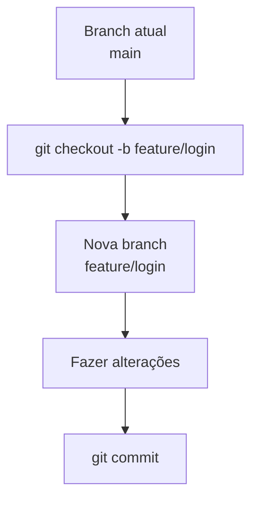
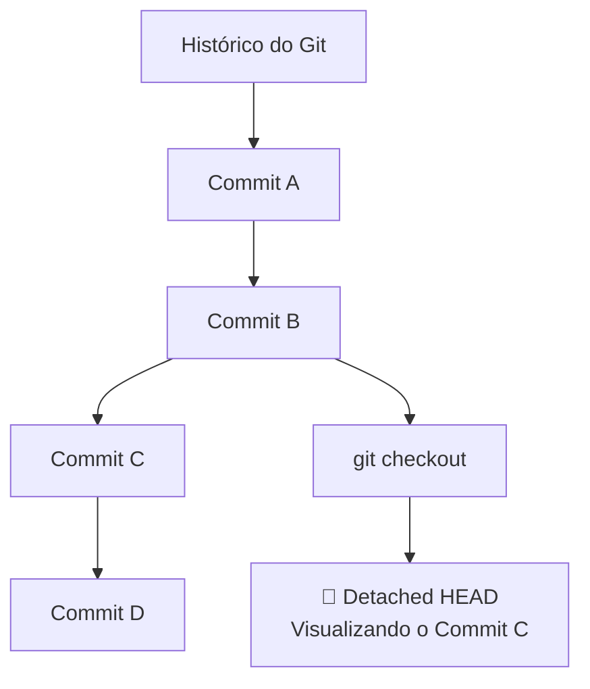
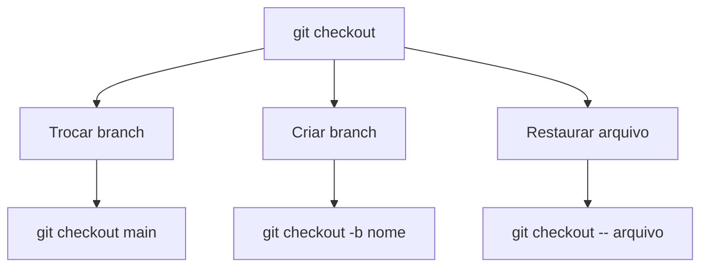

# `git checkout`

O comando `git checkout` é utilizado para **navegar entre branches** e, em versões mais antigas do Git, também para **restaurar arquivos para uma versão anterior**.

> ⚠️ Atualmente, o Git recomenda comandos mais específicos, como `git switch` para branches e `git restore` para arquivos. Mesmo assim, `git checkout` continua sendo muito utilizado e é importante conhecê-lo.

## 1. Trocar de branch

Para trocar para uma branch existente:

```bash
git checkout nome-da-branch
```

Por exemplo:

```bash
git checkout develop
```

Isso faz com que você passe a trabalhar na branch `develop`.

---

## 2. Criar e trocar para uma nova branch

Você também pode criar uma nova branch e entrar nela com um único comando:

```bash
git checkout -b feature/login
```

É equivalente a:

```bash
git branch feature/login
git checkout feature/login
```

### Fluxo



---

## 3. Restaurar um arquivo

O `git checkout` também pode ser usado para descartar alterações feitas em um arquivo:

```bash
git checkout -- README.md
```

Isso restaura o `README.md` para a versão registrada no último `commit`.

⚠️ **Cuidado:** as alterações locais descartadas dessa forma podem ser perdidas.

Atualmente, a forma recomendada é:

```bash
git restore README.md
```

---

## 4. Voltar para uma versão específica

Também é possível utilizar o `checkout` para acessar um `commit` específico:

```bash
git checkout <hash-do-commit>
```

Por exemplo:

```bash
git checkout a1b2c3d
```

Nesse caso, você estará visualizando o projeto naquele ponto específico do histórico.

Isso pode colocar o repositório em um estado chamado **Detached HEAD**.



## `checkout` × `switch` × `restore`

Hoje, é recomendado utilizar comandos mais específicos:

| Necessidade       | Antigo                    | Recomendado                  |
| ----------------- | ------------------------- | ---------------------------- |
| Trocar de branch  | `git checkout main`       | `git switch main`            |
| Criar branch      | `git checkout -b feature` | `git switch -c feature`      |
| Restaurar arquivo | `git checkout -- arquivo` | `git restore arquivo`        |
| Acessar um commit | `git checkout <hash>`     | `git switch --detach <hash>` |

### Resumo

O `git checkout` possui várias funções:



Para novos projetos, prefira **`git switch` para branches** e **`git restore` para arquivos**, deixando `git checkout` principalmente para entender e trabalhar com projetos que ainda utilizam esse comando.
