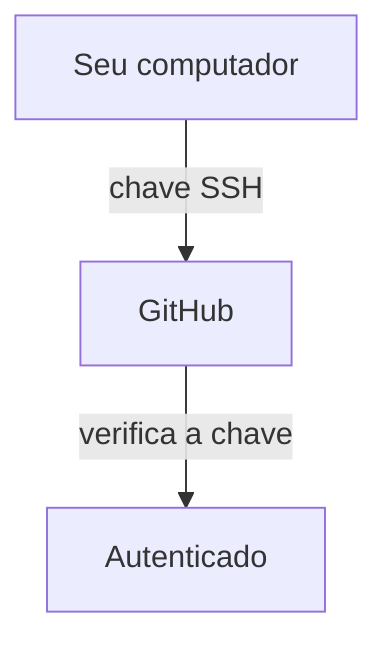

# `git clone`

Após criar um repositório seja no `GITHUB` ou `GITLAB`você pode clonar este repositório para o seu local de trabalho.

Comando:

## SSH

Utilizado quando vc tem uma configuração ssh entre a sua máquina e o repositório

```bash
git clone git@github.com:usuario/repositorio.git
```

## HTTPS

Utilizado quando vc não tem uma configuração ssh entre a sua máquina e o repositório

```bash
git clone https://github.com/usuario/repositorio.git
```

A diferença entre **Git via SSH** e **Git via HTTPS** não está no Git em si, mas principalmente em **como sua máquina se autentica no GitHub**.

## HTTPS

Exemplo:

```bash
git clone https://github.com/usuario/repositorio.git
```

O Git se conecta ao GitHub usando **HTTPS**.

Para operações que exigem autenticação, como `push`, o GitHub normalmente usa um **Personal Access Token (PAT)** ou um gerenciador de credenciais. Senhas comuns da conta do GitHub não são usadas para autenticar operações Git via HTTPS.

Exemplo:

```bash
git remote -v
```

```text
origin  https://github.com/usuario/repositorio.git (fetch)
origin  https://github.com/usuario/repositorio.git (push)
```

### Vantagens

* Fácil de configurar.
* Não precisa criar uma chave SSH.
* Funciona bem em computadores novos.
* É bastante conveniente para uso ocasional.

---

## SSH

Exemplo:

```bash
git clone git@github.com:usuario/repositorio.git
```

Nesse caso, a comunicação utiliza **SSH**.

Você normalmente cria um par de chaves:

```text
~/.ssh/
├── id_ed25519
└── id_ed25519.pub
```

A chave **privada** fica na sua máquina.

A chave **pública** é cadastrada no GitHub.

O fluxo fica:



Depois de configurar, você pode fazer:

```bash
git pull
git push
```

sem precisar fornecer um token a cada operação.

---

## Comparando

|                               | HTTPS                    | SSH                  |
| ----------------------------- | ------------------------ | -------------------- |
| URL                           | `https://github.com/...` | `git@github.com:...` |
| Autenticação                  | Token/credencial         | Chave SSH            |
| Configuração inicial          | Mais simples             | Um pouco maior       |
| Segurança                     | Muito boa                | Muito boa            |
| Precisa cadastrar chave?      | ❌                        | ✅                    |
| Bom para uso frequente        | ✅                        | ⭐                    |
| Bom para automação/servidores | ✅                        | ⭐                    |

### Um detalhe importante

Depois que você faz:

```bash
git clone https://github.com/usuario/repositorio.git
```

o Git **não fica "preso" ao HTTPS**.

Você pode trocar o endereço remoto para SSH:

```bash
git remote set-url origin git@github.com:usuario/repositorio.git
```

E verificar:

```bash
git remote -v
```

Agora aparecerá:

```text
origin  git@github.com:usuario/repositorio.git (fetch)
origin  git@github.com:usuario/repositorio.git (push)
```

Ou seja, **`clone`, `pull` e `push` continuam sendo comandos do Git; SSH e HTTPS são apenas os protocolos/métodos usados para conversar com o GitHub.**

Para quem trabalha frequentemente com GitHub, eu particularmente recomendo **SSH**, depois de configurá-lo corretamente.
