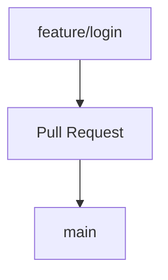
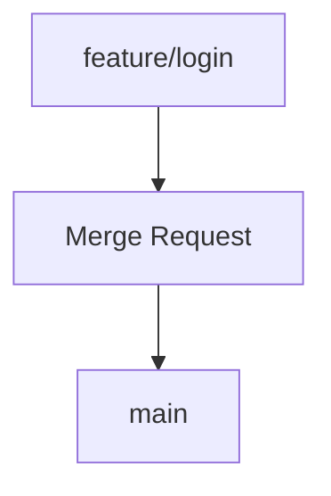

# `gitlab`

site: https://about.gitlab.com/pt-br/

O **GitLab** é uma plataforma de hospedagem e colaboração para projetos de software, semelhante ao GitHub.

Ele utiliza o **Git** para controle de versão e oferece recursos como:

* Repositórios Git
* Branches
* Commits
* Pull/Merge Requests
* Revisão de código
* Issues
* CI/CD
* Pipelines de automação
* Controle de permissões

### GitHub × GitLab

| GitHub            | GitLab               |
| ----------------- | -------------------- |
| Repositórios Git  | Repositórios Git     |
| Pull Request      | Merge Request        |
| GitHub Actions    | GitLab CI/CD         |
| Issues            | Issues               |
| GitHub Projects   | GitLab Issues/Boards |
| GitHub Codespaces | GitLab Workspaces    |

Uma diferença importante na terminologia é:

No GitHub:



No GitLab:



Apesar do nome diferente, **a ideia é muito parecida**: solicitar revisão e integração das alterações de uma branch em outra.

E os comandos Git continuam sendo praticamente os mesmos:

```bash
git add .
git commit -m "Adiciona login"
git push
```

O Git é a ferramenta de controle de versão; **GitHub e GitLab são plataformas que hospedam e adicionam recursos em torno dos repositórios Git**.

