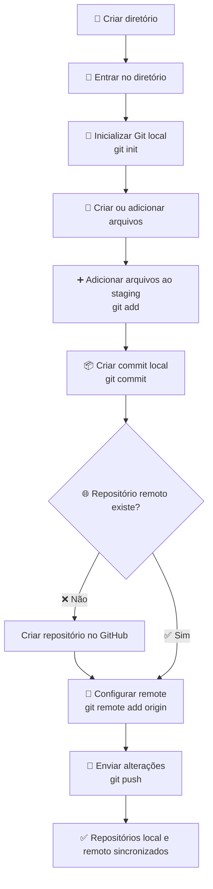

# `git init`

O comando `git init` é utilizado para **inicializar um repositório Git local** em um diretório.

## 1. Criar o repositório no GitHub

Primeiro, crie um novo repositório no [GitHub](https://github.com).

> **Importante:** se o repositório no GitHub for criado **sem o `README.md`**, você poderá inicializar o projeto localmente e fazer o primeiro `push` normalmente.

Caso o repositório tenha sido criado sem o `README.md`, execute:

```bash
mkdir apagar
cd apagar

echo "# apagar" >> README.md

git init
git add README.md
git commit -m "first commit"

git branch -M main

git remote add origin git@github.com:horadoqa/apagar.git

git push -u origin main
```

### O que cada comando faz?

| Comando                        | Descrição                           |
| ------------------------------ | ----------------------------------- |
| `mkdir apagar`                 | Cria o diretório do projeto         |
| `cd apagar`                    | Entra no diretório                  |
| `echo "# apagar" >> README.md` | Cria o arquivo `README.md`          |
| `git init`                     | Inicializa o repositório Git local  |
| `git add README.md`            | Adiciona o arquivo ao staging       |
| `git commit -m "first commit"` | Cria o primeiro commit              |
| `git branch -M main`           | Define `main` como branch principal |
| `git remote add origin ...`    | Adiciona o repositório remoto       |
| `git push -u origin main`      | Envia a branch `main` para o GitHub |

---

## 2. Fluxo do `git init`



## 3. Verificar o repositório remoto

Depois de configurar o `origin`, você pode verificar se ele está correto com:

```bash
git remote -v
```

O resultado deverá ser semelhante a:

```text
origin  git@github.com:horadoqa/apagar.git (fetch)
origin  git@github.com:horadoqa/apagar.git (push)
```

## 4. Primeiro `push`

Depois de criar o commit e configurar o `origin`:

```bash
git push -u origin main
```

A opção `-u` configura a branch remota como **upstream** da sua branch local. Depois disso, nos próximos envios, normalmente será suficiente executar:

```bash
git push
```

### ⚠️ Atenção ao criar o repositório no GitHub

Se você **já possui um projeto local com commits** e criou o repositório no GitHub marcando opções como **README**, `.gitignore` ou licença, o GitHub poderá criar um commit inicial no remoto.

Nesse cenário, o histórico local e remoto podem ficar diferentes, e um simples:

```bash
git push
```

pode ser rejeitado com:

```text
! [rejected] main -> main (fetch first)
```

Nesse caso, primeiro sincronize os históricos:

```bash
git pull origin main --rebase
```

e depois:

```bash
git push -u origin main
```

Isso evita sobrescrever alterações que já existem no repositório remoto.
