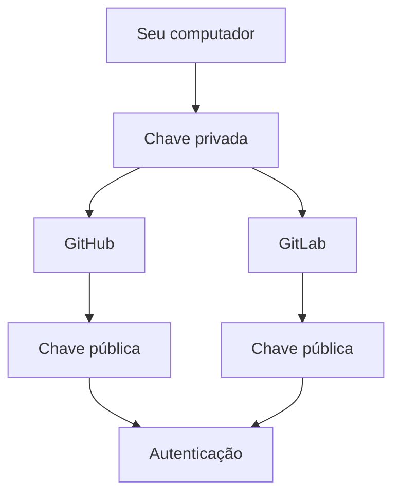
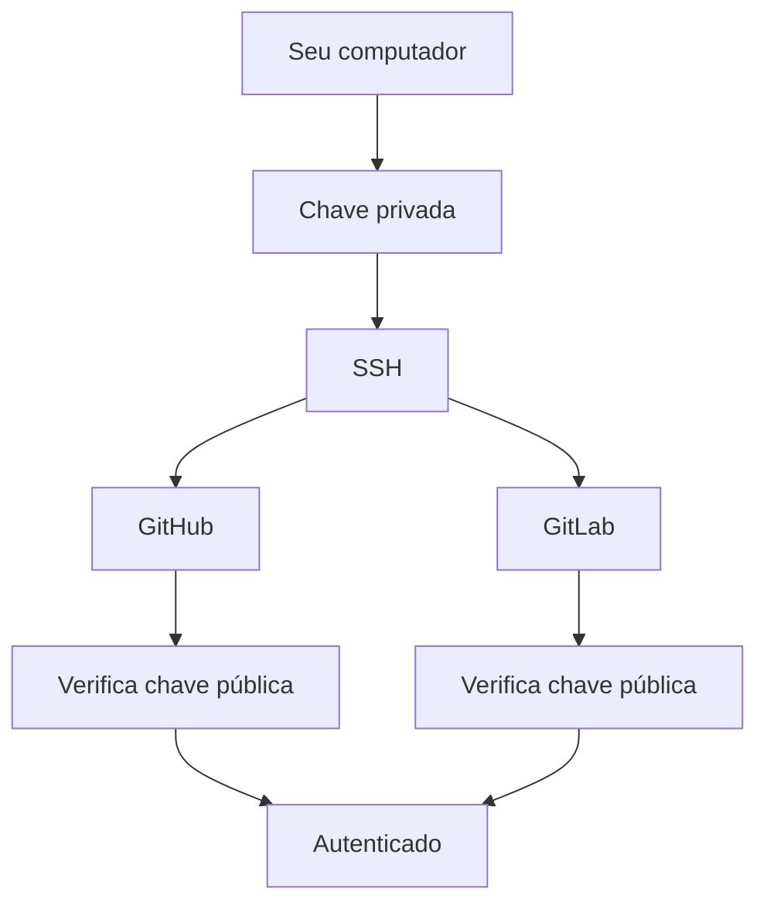

# `keys`

Criadas para garantia a segurança de comunicação entre o repositório local e o remoto.

OBS.: **A mesma chave SSH pode ser cadastrada tanto no GitHub quanto no GitLab**. Você não precisa necessariamente criar uma chave diferente para cada plataforma.

A ideia é:



O GitHub recomenda atualmente **Ed25519** para novas chaves, e o GitLab também indica Ed25519 como opção preferencial. ([GitHub Docs][1])

# 1. Verificar se já existe uma chave

Antes de criar uma nova, verifique:

```bash
ls -la ~/.ssh
```

Procure por arquivos como:

```text
id_ed25519
id_ed25519.pub
```

A diferença é:

```text
id_ed25519
    ↑
chave privada — NÃO compartilhe

id_ed25519.pub
    ↑
chave pública — pode ser cadastrada no GitHub/GitLab
```

A chave privada deve permanecer somente no seu computador. ([GitLab Docs][2])

---

# 2. Criar uma chave SSH

Se você ainda não tiver uma:

```bash
ssh-keygen -t ed25519 -C "seu_email@example.com"
```

Quando aparecer:

```text
Enter file in which to save the key:
```

pode pressionar `Enter` para utilizar o local padrão:

```text
~/.ssh/id_ed25519
```

Depois será solicitada uma **passphrase**.

Você pode definir uma senha para proteger a chave privada. O GitHub e o GitLab recomendam esse tipo de proteção adicional. ([GitHub Docs][1])

---

# 3. Adicionar a chave ao SSH Agent

No Linux/macOS:

```bash
eval "$(ssh-agent -s)"
```

Depois:

```bash
ssh-add ~/.ssh/id_ed25519
```

O `ssh-agent` ajuda a gerenciar a chave privada e, quando aplicável, evita que você precise informar a passphrase repetidamente. ([GitHub Docs][1])

---

# 4. Copiar a chave pública

Execute:

```bash
cat ~/.ssh/id_ed25519.pub
```

Você verá algo semelhante a:

```text
ssh-ed25519 AAAAC3NzaC1lZDI1NTE5AAAAI... seu_email@example.com
```

Copie **a linha inteira**.

⚠️ É o arquivo:

```text
id_ed25519.pub
```

que será cadastrado.

**Nunca copie:**

```text
id_ed25519
```

---

# 5. Adicionar ao GitHub

No GitHub:

```text
Settings
   ↓
SSH and GPG keys
   ↓
New SSH key
```

Informe um nome, por exemplo:

```text
Notebook pessoal
```

Cole o conteúdo de:

```text
~/.ssh/id_ed25519.pub
```

e clique em **Add SSH key**. ([GitHub Docs][3])

---

# 6. Testar o GitHub

Execute:

```bash
ssh -T git@github.com
```

Se estiver tudo correto, o GitHub deverá informar que você foi autenticado. ([GitHub Docs][3])

---

# 7. Adicionar a mesma chave ao GitLab

No GitLab:

```text
Edit profile
   ↓
Access
   ↓
SSH keys
   ↓
Add new key
```

Cole a mesma chave pública:

```text
~/.ssh/id_ed25519.pub
```

Informe um título, por exemplo:

```text
Notebook pessoal
```

e adicione a chave. ([GitLab Docs][2])

---

# 8. Testar o GitLab

Execute:

```bash
ssh -T git@gitlab.com
```

Se estiver configurado corretamente, o GitLab deverá retornar uma mensagem de boas-vindas. ([GitLab Docs][2])

---

# 9. Agora você pode usar os dois

### GitHub

```bash
git clone git@github.com:horadoqa/exercicios-git.git
```

### GitLab

```bash
git clone git@gitlab.com:usuario/projeto.git
```

A autenticação SSH será feita usando a chave que está no seu computador.



## Uma observação importante

Para **um único computador e uma única conta**, usar a mesma chave no GitHub e no GitLab é perfeitamente possível.

Porém, em cenários mais avançados, como:

```text
Computador pessoal → GitHub pessoal
Computador pessoal → GitHub empresa
Computador pessoal → GitLab empresa
```

pode ser interessante criar **chaves diferentes** e configurar o `~/.ssh/config` para determinar qual chave usar em cada serviço.

Para o seu exercício de Git, eu recomendo começar com **uma chave Ed25519** e cadastrá-la tanto no GitHub quanto no GitLab. ([GitHub Docs][1])

[Documentação oficial do GitHub — SSH](https://docs.github.com/pt/authentication/connecting-to-github-with-ssh/generating-a-new-ssh-key-and-adding-it-to-the-ssh-agent?utm_source=chatgpt.com)
[Documentação oficial do GitLab — SSH](https://docs.gitlab.com/user/ssh/?utm_source=chatgpt.com)

[1]: https://docs.github.com/pt/authentication/connecting-to-github-with-ssh/generating-a-new-ssh-key-and-adding-it-to-the-ssh-agent?utm_source=chatgpt.com "Gerando uma nova chave SSH e adicionando-a ao agente SSH - Documentos do GitHub"
[2]: https://docs.gitlab.com/user/ssh/?utm_source=chatgpt.com "Use SSH keys with GitLab | GitLab Docs"
[3]: https://docs.github.com/en/authentication/connecting-to-github-with-ssh/adding-a-new-ssh-key-to-your-github-account?tool=webui&utm_source=chatgpt.com "Adding a new SSH key to your GitHub account - GitHub Docs"
