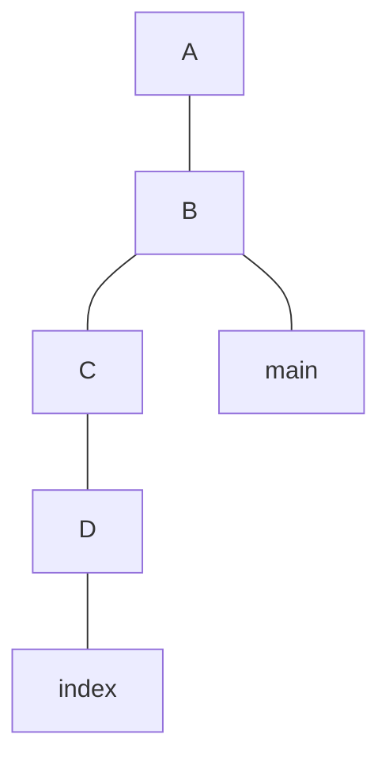
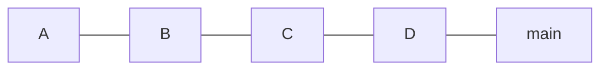
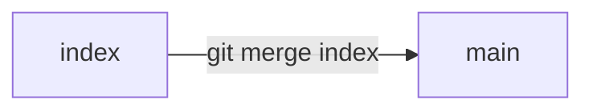
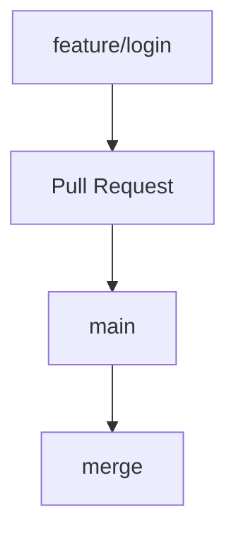

# `merge`

# O que é `merge`?

No Git, **`merge` significa integrar as alterações de uma branch em outra**.

Imagine que você tenha:



A branch `index` possui dois commits (`C` e `D`) que não estão na `main`.

Se você estiver na `main` e executar:

```bash
git merge index
```

o Git vai **integrar os commits da `index` na `main`**.



## O ponto mais importante

O `merge` sempre acontece **na branch atual**.

Por exemplo:

```bash
git switch main
git merge index
```

Significa:

> "Estou na `main`. Pegue as alterações da `index` e integre-as à `main`."

Podemos visualizar assim:



### Outro exemplo

Se você fizer:

```bash
git switch develop
git merge feature/login
```

significa:

> Integrar `feature/login` dentro de `develop`.


### Em uma frase

> **`git merge` pega o histórico de uma branch e integra esse histórico à branch atual.**

É por isso que, em um fluxo com Pull Request, podemos ter:



O **Pull Request** é o processo de revisão/discussão; o **merge** é a operação que efetivamente integra as alterações de uma branch na outra.
