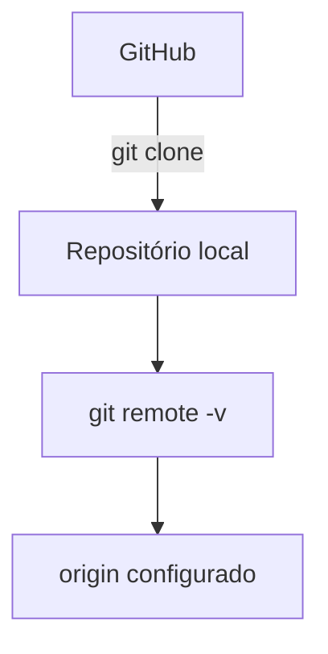
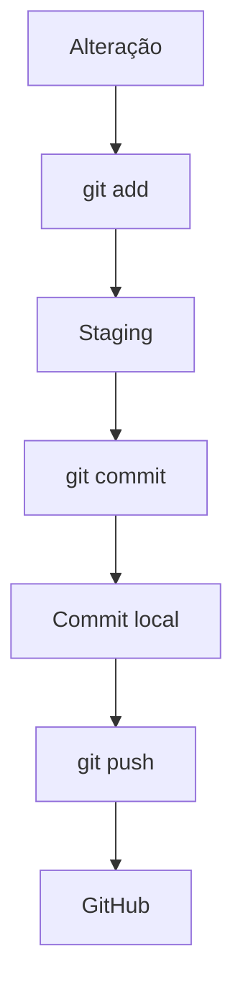
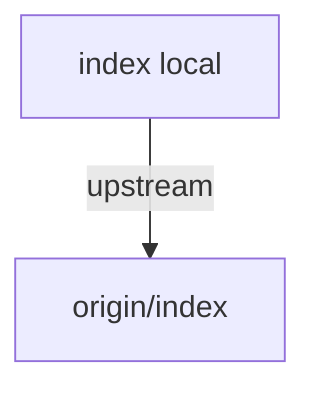
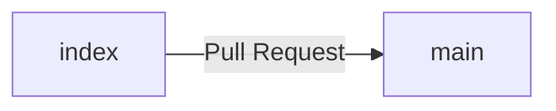
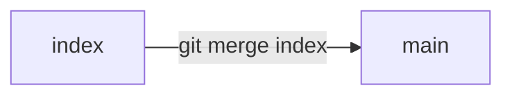
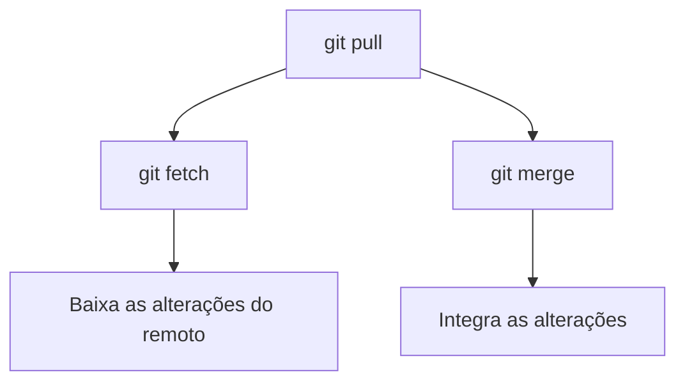
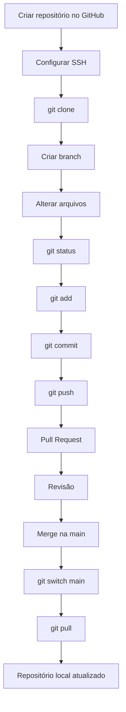
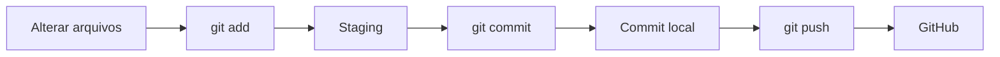
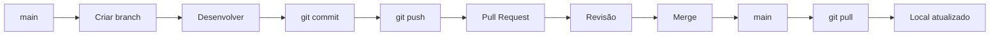

# Praticando Git e GitHub

Aqui estão alguns conceitos e exemplos práticos para aprender a trabalhar com **Git e GitHub**, desde a criação e clonagem de um repositório até o uso de branches, commits, Pull Requests, merge e sincronização com o repositório remoto.

---

# 1. Criando um repositório

Dentro do [GitHub](https://github.com/usuario), acesse a aba `Repositories` e clique em `New`.

Preencha as informações do repositório.

### Repository name

Nome do repositório. Para este exercício, utilizaremos:

```text
exercicios-git
```

### Description

Descrição do repositório:

```text
Exercícios de Git e GitHub
```

### Visibility

Selecione se o repositório será:

* `Public`
* `Private`

### Add a README file

Marque a opção:

```text
Add a README file
```

O repositório será inicializado com um arquivo `README.md`.

Neste exercício, o conteúdo inicial será:

```markdown
# Página WEB, com HTML, CSS e JavaScript
```

Após realizar as configurações, clique em:

```text
Create repository
```

O repositório será criado com o nome:

```text
exercicios-git
```

---

# 2. Configurando SSH

Para utilizar o GitHub por meio de SSH, precisamos configurar uma chave SSH no computador.

Isso permitirá autenticar a máquina no GitHub sem precisar informar as credenciais da conta a cada operação.

## 2.1. Abrir o terminal

* **Linux/macOS:** abra o Terminal.
* **Windows:** utilize o Git Bash ou o PowerShell.

## 2.2. Gerar a chave SSH

Execute:

```bash
ssh-keygen -t ed25519 -C "seu_email@example.com"
```

O comando:

* `-t ed25519` define o tipo da chave.
* `-C` adiciona um comentário para identificar a chave.

Quando o terminal perguntar onde salvar a chave, você pode pressionar `Enter` para utilizar o local padrão:

```text
~/.ssh/id_ed25519
```

Será solicitada uma senha (*passphrase*) para proteger a chave privada.

Essa senha é opcional, mas recomendada.

> **Importante:** nunca compartilhe sua chave privada. O arquivo `id_ed25519` deve permanecer somente no seu computador. A chave que será cadastrada no GitHub é a `id_ed25519.pub`.

## 2.3. Exibir a chave pública

Execute:

```bash
cat ~/.ssh/id_ed25519.pub
```

Copie todo o conteúdo exibido.

## 2.4. Adicionar a chave ao GitHub

No GitHub:

1. Acesse **Settings**.
2. Acesse **SSH and GPG keys**.
3. Clique em **New SSH key**.
4. Informe um nome no campo **Title**, por exemplo:

   ```text
   Meu laptop
   ```
5. Cole a chave pública no campo **Key**.
6. Clique em **Add SSH key**.

## 2.5. Testar a conexão

Execute:

```bash
ssh -T git@github.com
```

Se estiver tudo configurado corretamente, o GitHub exibirá uma mensagem semelhante a:

```text
Hi <username>! You've successfully authenticated, but GitHub does not provide shell access.
```

Agora a máquina está configurada para utilizar SSH com o GitHub.

---

# 3. Clonando um repositório

O comando `git clone` cria uma cópia de um repositório remoto na máquina local.

Como o repositório já foi criado no GitHub, podemos cloná-lo:

```bash
git clone git@github.com:usuario/exercicios-git.git
```

O `git clone` também configura automaticamente o repositório remoto como `origin`.

Podemos verificar isso com:

```bash
git remote -v
```

Resultado esperado:

```text
origin  git@github.com:usuario/exercicios-git.git (fetch)
origin  git@github.com:usuario/exercicios-git.git (push)
```

Depois, entre no diretório:

```bash
cd exercicios-git
```

O fluxo é:



---

# 4. Trabalhando com branches

Um projeto pode ter diversos colaboradores. O Git permite criar **branches** para que cada desenvolvedor possa trabalhar em funcionalidades, correções ou experimentos de forma isolada.

Dessa maneira, as alterações podem ser testadas e revisadas antes de serem integradas à branch principal, normalmente chamada `main`.

---

## 4.1. Listando as branches

Para visualizar as branches locais:

```bash
git branch
```

Exemplo:

```text
* main
```

O `*` indica a branch atual.

Para visualizar as branches locais e remotas:

```bash
git branch -a
```

Exemplo:

```text
* main
  remotes/origin/HEAD -> origin/main
  remotes/origin/main
```

---

## 4.2. Criando uma branch

Para criar uma branch:

```bash
git branch index
```

Esse comando cria a branch, mas **não muda para ela**.

Podemos verificar:

```bash
git branch
```

Resultado:

```text
* main
  index
```

---

## 4.3. Mudando de branch

Para trocar para a branch `index`:

```bash
git switch index
```

Resultado:

```text
Switched to branch 'index'
```

Agora:

```bash
git branch
```

poderá mostrar:

```text
  main
* index
```

O `*` indica que estamos trabalhando na branch `index`.

Também é possível criar e mudar para uma nova branch com um único comando:

```bash
git switch -c index
```

O `-c` significa **create**.

> O comando `git checkout` também pode ser utilizado para trocar de branch, mas atualmente é recomendado utilizar `git switch` para operações relacionadas a branches.

---

## 4.4. Branch anterior

Para voltar rapidamente para a branch anterior:

```bash
git switch -
```

Exemplo:

```text
main
  ↓
git switch index
  ↓
index
  ↓
git switch -
  ↓
main
```

---

## 4.5. Excluindo uma branch local

Para excluir uma branch:

```bash
git branch -d index
```

A opção `-d` realiza uma exclusão segura. O Git normalmente impede a exclusão caso existam commits que ainda não tenham sido integrados a outra branch.

Se você realmente quiser forçar a exclusão:

```bash
git branch -D index
```

A opção `-D` deve ser utilizada com cuidado, pois pode excluir uma branch que possui commits ainda não integrados.

---

## 4.6. Excluindo uma branch remota

Para excluir uma branch do repositório remoto:

```bash
git push origin --delete index
```

Resultado:

```text
To github.com:usuario/exercicios-git.git
 - [deleted]         index
```

---

# 5. Trabalhando com arquivos

Agora vamos criar um arquivo na branch `index`.

## 5.1. Criando um arquivo

Podemos utilizar o comando `touch`:

```bash
touch index.html
```

---

# 6. `git status`

O comando `git status` permite verificar o estado atual do repositório.

Ele mostra, entre outras informações:

* arquivos modificados;
* arquivos novos;
* arquivos removidos;
* arquivos adicionados ao staging;
* a branch atual.

Execute:

```bash
git status
```

Exemplo:

```text
On branch index

Untracked files:
  (use "git add <file>..." to include in what will be committed)
        index.html

nothing added to commit but untracked files present (use "git add" to track)
```

Nesse exemplo, `index.html` é um arquivo novo que ainda não está sendo rastreado pelo Git.

---

# 7. `git add`

O comando `git add` adiciona alterações à área de **staging**, preparando-as para o próximo commit.

Para adicionar um arquivo específico:

```bash
git add index.html
```

Para adicionar todas as alterações:

```bash
git add .
```

O fluxo é:



---

# 8. `git commit`

O `git commit` registra as alterações que estão no staging no histórico local do Git.

Para criar um commit:

```bash
git commit -m "Criando o arquivo index.html"
```

Exemplo:

```text
[index 27d018d] Criando o arquivo index.html
 1 file changed, 0 insertions(+), 0 deletions(-)
 create mode 100644 index.html
```

Observe que o commit foi criado na branch `index`.

---

# 9. `git log`

O comando `git log` permite visualizar o histórico de commits.

```bash
git log
```

Exemplo:

```text
commit f118ef7002bbae06bbcaf58c414fcfa58f1c9d83 (HEAD -> index)
Author: Hora do QA <usuario@gmail.com>
Date:   Fri Jan 24 14:26:58 2025 -0300

    Criando o arquivo index.html

commit 3faa9a7a746e9953941fdadac6b8aa813c2ed9e4 (origin/main, origin/HEAD, main)
Author: Hora do QA <usuario@gmail.com>
Date:   Fri Jan 24 14:26:04 2025 -0300

    Initial commit
```

Neste exemplo:

```text
HEAD -> index
```

indica que o `HEAD` está apontando para a branch `index`.

Já:

```text
origin/main
```

representa a referência local para a branch `main` do repositório remoto `origin`.

Para sair da visualização do `git log`, pressione:

```text
q
```

---

# 10. `git push`

O comando `git push` envia os commits do repositório local para o repositório remoto.

Primeiro, podemos tentar:

```bash
git push
```

Como a branch `index` ainda não possui uma branch remota associada, o Git poderá apresentar:

```text
fatal: The current branch index has no upstream branch.
To push the current branch and set the remote as upstream, use

    git push --set-upstream origin index
```

Nesse caso, execute:

```bash
git push --set-upstream origin index
```

Também podemos utilizar a forma abreviada:

```bash
git push -u origin index
```

A opção `-u` é uma abreviação de `--set-upstream`.

Resultado esperado:

```text
Enumerating objects: 4, done.
Counting objects: 100% (4/4), done.
Delta compression using up to 8 threads
Compressing objects: 100% (2/2), done.
Writing objects: 100% (3/3), 292 bytes | 292.00 KiB/s, done.
Total 3 (delta 0), reused 0 (delta 0), pack-reused 0
To github.com:usuario/exercicios-git.git
 * [new branch]      index -> index
Branch 'index' set up to track remote branch 'index' from 'origin'.
```

Agora existe uma relação de *upstream*:



A partir desse momento, podemos utilizar simplesmente:

```bash
git push
```

para enviar novos commits da branch `index`.

---

# 11. Pull Request

Depois de enviar a branch `index` para o GitHub, podemos solicitar que suas alterações sejam revisadas antes de integrá-las à `main`.

Esse processo é realizado por meio de um **Pull Request (PR)**.

O fluxo será:



## 11.1. Criando o Pull Request

Depois do `git push`, o GitHub poderá apresentar uma mensagem semelhante a:

```text
index had recent pushes
```

e um botão:

```text
Compare & pull request
```

Clique nesse botão.

Também é possível acessar diretamente a área de Pull Requests do repositório.

Na tela do Pull Request:

1. Verifique a branch de origem:

   ```text
   index
   ```
2. Verifique a branch de destino:

   ```text
   main
   ```
3. Informe um título.
4. Adicione uma descrição explicando as alterações.
5. Clique em:

   ```text
   Create pull request
   ```

O Pull Request permite que as alterações sejam analisadas antes de serem integradas à branch `main`.

---

# 12. Revisando o Pull Request

Depois de criar o PR, os colaboradores podem:

* revisar o código;
* fazer comentários;
* solicitar alterações;
* aprovar as alterações.

Caso sejam necessárias novas alterações, basta continuar trabalhando na branch `index`.

Por exemplo:

```bash
git add .
git commit -m "Ajusta index.html"
git push
```

O novo commit será automaticamente associado ao Pull Request existente.

---

# 13. `git merge`

O `merge` é utilizado para **integrar as alterações de uma branch em outra**.

Neste exercício, o merge será realizado depois que o Pull Request for revisado e aprovado.

> O Git não exige que um `merge` seja feito por meio de um Pull Request. Também é possível executar `git merge` diretamente no terminal.

Imagine que temos:

```text
main
index
```

Queremos integrar `index` à `main`.

Primeiro, mudamos para a branch que receberá as alterações:

```bash
git switch main
```

Depois:

```bash
git merge index
```

A branch atual é o **destino** do merge.



Se não houver conflitos, o Git realizará o merge automaticamente.

---

# 14. Conflito de merge

Um conflito pode ocorrer quando duas branches alteram a mesma parte de um arquivo de maneiras incompatíveis.

Por exemplo:

```text
<<<<<<< HEAD
Código da branch main
=======
Código da branch index
>>>>>>> index
```

O Git não consegue decidir sozinho qual alteração deve permanecer.

Nesse caso:

1. Identifique os arquivos em conflito:

```bash
git status
```

2. Abra os arquivos e resolva os conflitos.

3. Remova os marcadores:

```text
<<<<<<<
=======
>>>>>>>
```

4. Adicione o arquivo resolvido:

```bash
git add arquivo_com_conflito
```

5. Finalize o merge:

```bash
git commit -m "Resolve conflito de merge"
```

Durante um conflito, `HEAD` representa a versão da branch que está recebendo o merge.

---

# 15. `git pull`

O comando `git pull` é utilizado para **baixar alterações do repositório remoto e integrá-las à branch local atual**.

De forma simplificada:



Ou seja:

```bash
git pull
```

é, de forma simplificada, equivalente a:

```bash
git fetch
git merge
```

---

# 16. Atualizando a `main`

Depois que o Pull Request for aprovado e integrado à `main` no GitHub, nossa branch `main` local poderá estar desatualizada.

Primeiro, mudamos para a `main`:

```bash
git switch main
```

Depois:

```bash
git pull
```

O Git buscará as alterações do GitHub e atualizará a branch local.

Exemplo:

```text
remote: Enumerating objects: 1, done.
remote: Counting objects: 100% (1/1), done.
remote: Total 1 (delta 0), reused 0 (delta 0), pack-reused 0
Unpacking objects: 100% (1/1), 892 bytes | 178.00 KiB/s, done.
From github.com:usuario/exercicios-git
   3faa9a7..fe48348  main       -> origin/main
Updating 3faa9a7..fe48348
Fast-forward
 index.html | 0
 1 file changed, 0 insertions(+), 0 deletions(-)
 create mode 100644 index.html
```

Nesse caso:

```text
Fast-forward
```

significa que não foi necessário criar um novo commit de merge. A branch `main` local simplesmente avançou para o commit mais recente disponível no remoto.

---

# 17. Fluxo completo

O fluxo praticado neste exercício pode ser representado da seguinte forma:



## Resumo dos principais comandos

| Comando      | Função                                  |
| ------------ | --------------------------------------- |
| `git clone`  | Clona um repositório remoto             |
| `git branch` | Lista e gerencia branches               |
| `git switch` | Troca de branch                         |
| `git status` | Mostra o estado do repositório          |
| `git add`    | Adiciona alterações ao staging          |
| `git commit` | Registra alterações no histórico local  |
| `git log`    | Exibe o histórico de commits            |
| `git push`   | Envia commits para o repositório remoto |
| `git pull`   | Baixa e integra alterações do remoto    |
| `git merge`  | Integra uma branch em outra             |

### Fluxo básico do Git



### Fluxo colaborativo


