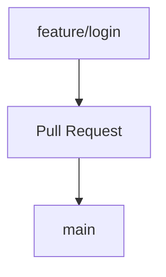
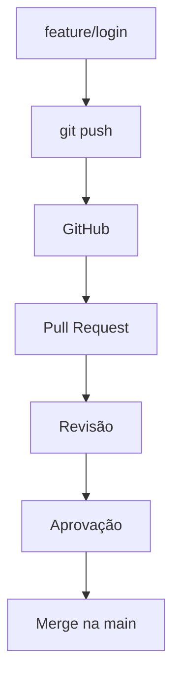

# `Pull Request`

Um **Pull Request (PR)** é uma solicitação para **integrar as alterações de uma branch em outra**, normalmente de uma branch de funcionalidade para a `main`.

Por exemplo:



Na prática, você trabalha em uma branch:

```bash
git switch -c feature/login
```

Faz suas alterações:

```bash
git add .
git commit -m "Adiciona tela de login"
```

Envia a branch para o GitHub:

```bash
git push -u origin feature/login
```

Depois, no GitHub, você cria um **Pull Request** solicitando:

> "Quero integrar a `feature/login` na `main`."



## O que acontece durante um PR?

O Pull Request permite que outras pessoas:

* revisem o código;
* façam comentários;
* identifiquem problemas;
* solicitem alterações;
* executem testes;
* aprovem ou rejeitem a integração.

Se forem solicitadas alterações, você continua trabalhando na mesma branch:

```bash
git add .
git commit -m "Corrige validação do login"
git push
```

O novo commit aparecerá automaticamente no Pull Request.

### PR não é `merge`

Essa diferença é importante:

**Pull Request:**

> "Gostaria de integrar estas alterações. Podem revisar?"

**Merge:**

> "As alterações foram integradas à branch de destino."


Portanto, uma forma simples de memorizar é:

> **Pull Request = pedido para integrar alterações.**
> **Merge = integração das alterações.**
