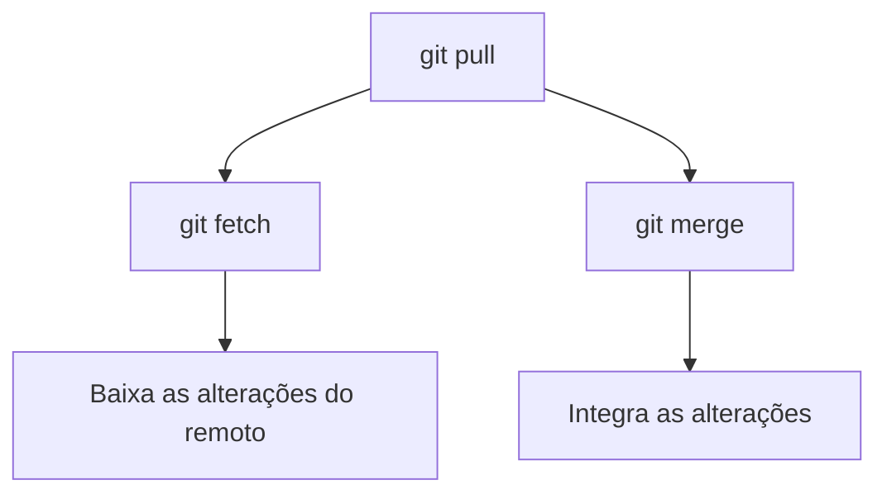
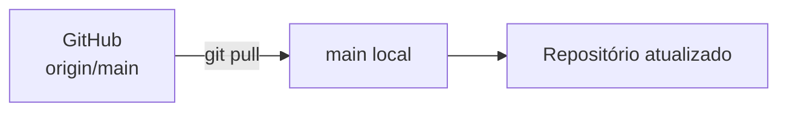
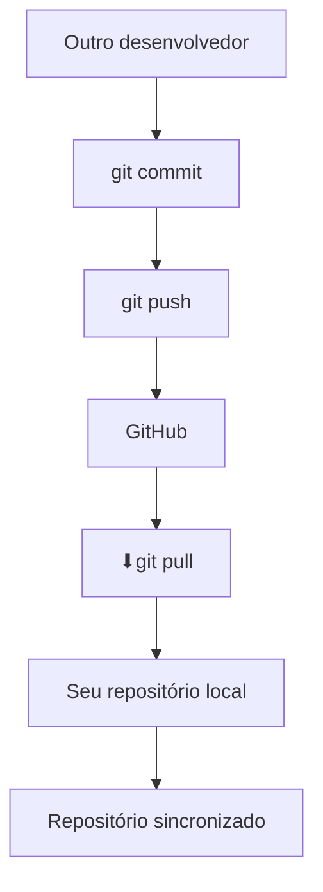
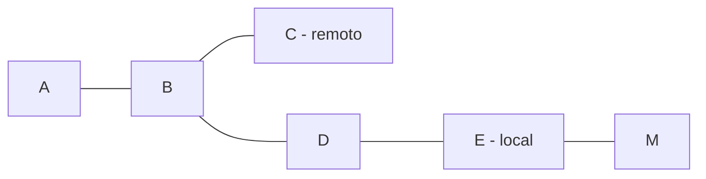
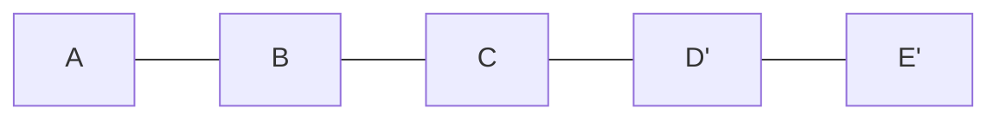
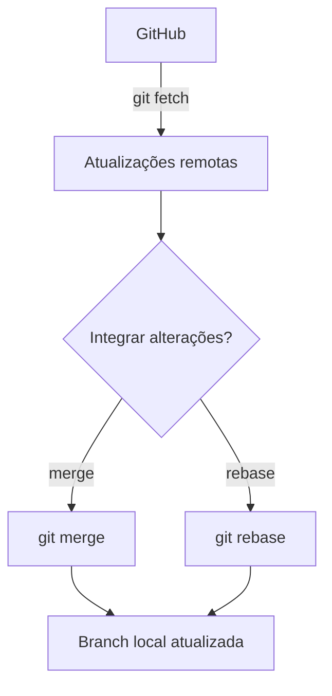
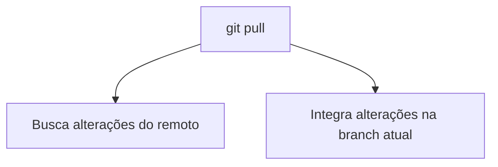

# `git pull`

O comando `git pull` é utilizado para **baixar as alterações do repositório remoto e integrá-las à branch local atual**.

Em outras palavras, ele permite **sincronizar seu repositório local com o repositório remoto**, como o GitHub.

```bash
git pull
```

## Como funciona?

O `git pull` é, essencialmente, uma combinação de dois comandos:



Ou seja:

```bash
git pull
```

é aproximadamente equivalente a:

```bash
git fetch
git merge
```

> **Importante:** `git pull` não significa apenas "baixar arquivos". Ele também tenta **integrar as alterações remotas à sua branch local**.

---

## 1. Atualizar a branch atual

Se você estiver na branch `main`:

```bash
git switch main
git pull
```

O Git buscará as alterações da branch remota associada à sua `main` e tentará integrá-las à sua branch local.



---

## 2. Especificar o repositório e a branch

Você também pode informar explicitamente o remoto e a branch:

```bash
git pull origin main
```

Onde:

* `origin` → nome do repositório remoto.
* `main` → branch que será buscada.

Isso é especialmente útil para entender exatamente de onde as alterações estão vindo.

---

## 3. Exemplo prático

Imagine que você e outra pessoa trabalham no mesmo projeto.

A outra pessoa fez:

```text
git add .
git commit -m "Adiciona login"
git push
```

Agora o GitHub possui um commit que sua máquina ainda não possui.

Você pode atualizar seu repositório com:

```bash
git pull
```

O fluxo será:



---

## 4. `git pull` com `rebase`

Por padrão, o `git pull` pode utilizar `merge` para integrar os históricos.

Você também pode solicitar um `rebase`:

```bash
git pull --rebase
```

Ou:

```bash
git pull origin main --rebase
```

A ideia é reorganizar seus commits locais para que eles fiquem **depois dos commits que vieram do remoto**.

De forma simplificada:

### Com `merge`



### Com `rebase`



O `rebase` pode deixar o histórico mais linear, mas é importante entender o comportamento antes de utilizá-lo em projetos compartilhados.

---

## 5. E se houver conflito?

Imagine que você alterou:

```text
README.md
```

e outra pessoa também alterou a mesma parte do arquivo e fez `push`.

Ao executar:

```bash
git pull
```

o Git pode não conseguir decidir automaticamente qual alteração deve permanecer.

Nesse caso, ocorrerá um **conflito**.

O `git status` ajudará a identificar os arquivos conflitantes:

```bash
git status
```

Depois de resolver manualmente os conflitos:

```bash
git add README.md
```

E finalize o merge:

```bash
git commit
```

Se estiver utilizando `--rebase`, o processo é diferente:

```bash
git add README.md
git rebase --continue
```

---

## `git pull` × `git fetch`

Essa diferença é muito importante:

| Comando      | O que faz                                                           |
| ------------ | ------------------------------------------------------------------- |
| `git fetch`  | ⬇️ Baixa informações do remoto, mas **não altera sua branch atual** |
| `git pull`   | ⬇️ Baixa informações e **integra as alterações**                    |
| `git merge`  | 🔀 Integra duas linhas de histórico                                 |
| `git rebase` | 🔄 Reorganiza os commits sobre uma nova base                        |

Por exemplo:

```bash
git fetch origin
```

é uma operação mais segura para **primeiro verificar o que mudou** antes de integrar.

Já:

```bash
git pull
```

faz o download e tenta integrar imediatamente.

---

## Fluxo completo



### Resumo



> **Resumo:** use `git pull` quando quiser **trazer as alterações do repositório remoto para sua branch local e sincronizar seu projeto**. Em equipes, é uma boa prática entender se o projeto utiliza `merge` ou `rebase` antes de definir o fluxo de `pull`.
