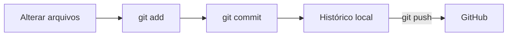
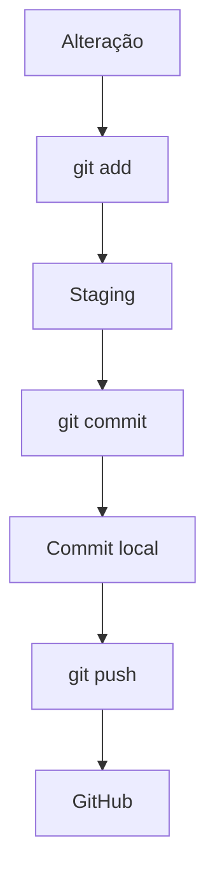
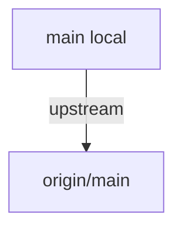
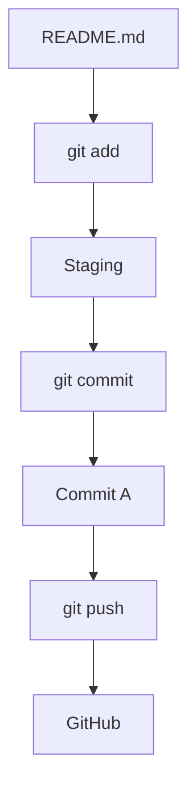
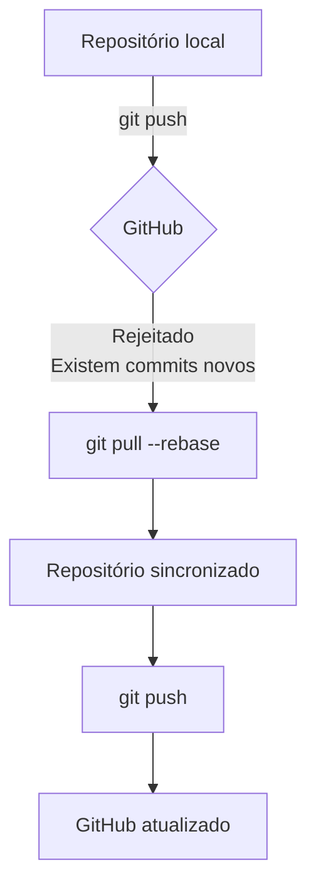
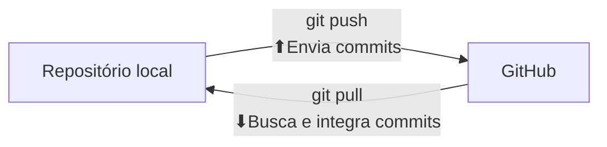
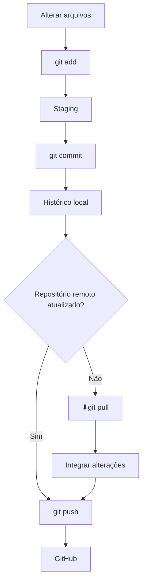

# `git push`

O comando `git push` é utilizado para **enviar os commits do seu repositório local para um repositório remoto**, como o GitHub.

Em outras palavras:

> **`git push` envia para o GitHub os commits que existem localmente, mas ainda não estão no repositório remoto.**

```bash
git push
```

## Como funciona?

O fluxo básico do Git é:



É importante entender que o `git push` **não envia simplesmente qualquer alteração que esteja no seu computador**.

Antes dele, normalmente precisamos fazer:

```bash
git add .
git commit -m "Minha alteração"
git push
```

Ou seja:



---

## 1. Primeiro `push`

Quando você cria um repositório local com `git init`, precisa configurar o repositório remoto:

```bash
git remote add origin git@github.com:horadoqa/apagar.git
```

Depois, pode enviar a branch `main`:

```bash
git push -u origin main
```

### O que significa `-u`?

A opção `-u` significa **`--set-upstream`**.

Ela estabelece uma relação entre sua branch local e a branch remota:



Depois de configurar isso pela primeira vez, você normalmente poderá utilizar apenas:

```bash
git push
```

---

## 2. `git push origin main`

Você também pode especificar explicitamente o repositório remoto e a branch:

```bash
git push origin main
```

Onde:

* `origin` → nome do repositório remoto.
* `main` → branch que será enviada.

Por exemplo:

```bash
git push origin develop
```

envia a branch `develop` para o remoto `origin`.

---

## 3. Criando e enviando uma nova branch

Imagine que você esteja na `main` e queira criar uma branch para desenvolver uma funcionalidade:

```bash
git switch -c feature/login
```

Depois de fazer suas alterações:

```bash
git add .
git commit -m "Adiciona tela de login"
```

Para enviar essa nova branch ao GitHub:

```bash
git push -u origin feature/login
```

Depois disso, os próximos `push` nessa branch podem ser feitos simplesmente com:

```bash
git push
```

---

## 4. O `git push` envia arquivos ou commits?

Essa é uma distinção importante.

O `git push` **envia commits**, não simplesmente arquivos.

Por exemplo:



Se você apenas modificar o `README.md`:

```bash
git push
```

não terá nada novo para enviar.

Você primeiro precisa criar um `commit`:

```bash
git add README.md
git commit -m "Atualiza README"
git push
```

---

## 5. Quando o `push` é rejeitado?

Pode acontecer de o GitHub possuir commits que sua máquina ainda não possui.

Nesse caso:

```bash
git push
```

pode retornar:

```text
! [rejected] main -> main (fetch first)
error: failed to push some refs
```

Isso acontece porque o Git evita que você sobrescreva o histórico remoto.

Normalmente, primeiro você deve sincronizar:

```bash
git pull --rebase
```

e depois:

```bash
git push
```

O fluxo fica:



---

## 6. `git push` × `git pull`

Os dois comandos fazem movimentos opostos:



| Comando    | Direção | Função                               |
| ---------- | ------- | ------------------------------------ |
| `git push` | 💻 → 🌐 | Envia commits para o remoto          |
| `git pull` | 🌐 → 💻 | Busca e integra alterações do remoto |

---

## Fluxo completo



### Resumo

```text
git push
    │
    ├── Pega os commits locais
    │
    ├── ⬆Envia para o repositório remoto
    │
    └── Atualiza o GitHub
```

> **Resumo:** `git push` é o comando utilizado para **publicar no repositório remoto os commits que você criou localmente**. Ele normalmente vem depois de `git add` e `git commit`.
