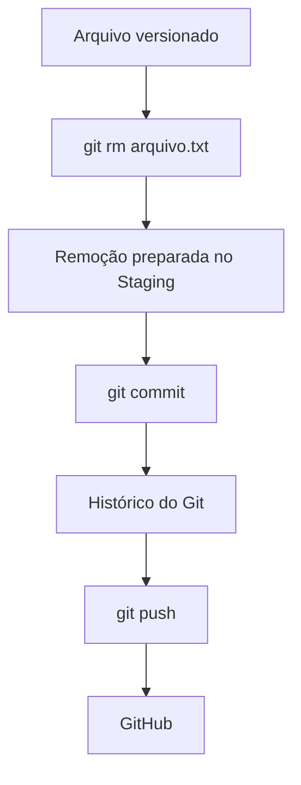

# `git rm`

O comando `git rm` é utilizado para **remover arquivos do projeto e também do controle de versão do Git**.

Diferentemente de simplesmente utilizar `rm`, o `git rm` já prepara a remoção para o próximo `commit`.

## 1. Remover um arquivo

Para remover um arquivo do projeto:

```bash
git rm README.md
```

Isso faz duas coisas:

1. Remove o arquivo do diretório de trabalho.
2. Remove o arquivo do *staging*, preparando a exclusão para o próximo `commit`.

Depois, verifique o estado do repositório:

```bash
git status
```

E registre a remoção:

```bash
git commit -m "Remove README"
```

---

## 2. Remover vários arquivos

Você pode remover vários arquivos de uma vez:

```bash
git rm arquivo1.txt arquivo2.txt arquivo3.txt
```

Ou todos os arquivos que correspondem a um padrão:

```bash
git rm *.txt
```

---

## 3. Remover um diretório

Para remover um diretório e seus arquivos:

```bash
git rm -r documentos/
```

O `-r` significa **recursivo**, permitindo remover o diretório e tudo o que estiver dentro dele.

---

## 4. Remover somente do Git

Às vezes você quer **manter o arquivo no seu computador**, mas não quer mais que ele seja controlado pelo Git.

Nesse caso, utilize:

```bash
git rm --cached arquivo.txt
```

Por exemplo:

```bash
git rm --cached .env
```

O arquivo continuará existindo no seu computador, mas será removido do controle de versão.

Normalmente, nesse cenário, também é importante adicioná-lo ao `.gitignore`:

```text
.env
```

Assim, o Git não voltará a identificá-lo como um arquivo não rastreado.

### `git rm` × `git rm --cached`

| Comando                       | Arquivo local | Git                    |
| ----------------------------- | ------------- | ---------------------- |
| `git rm arquivo.txt`          | 🗑️ Remove    | 🗑️ Remove do controle |
| `git rm --cached arquivo.txt` | ✅ Mantém      | 🗑️ Remove do controle |

---

## 5. Fluxo do `git rm`



## 6. Cuidado com `git rm`

O comando:

```bash
git rm arquivo.txt
```

**remove o arquivo imediatamente do diretório de trabalho**.

Se o arquivo tiver alterações que ainda não foram salvas em um `commit`, tome cuidado para não perder esse conteúdo.

Você pode verificar antes com:

```bash
git status
```

### Resumo

```text
flowchart TD
    A["git rm arquivo.txt"] --> B["Remove o arquivo do computador"]
    A --> C["Prepara a remoção no Staging"]
    C --> D["git commit"]
    D --> E["Histórico"]
```

> **Resumo:** use `git rm` quando quiser **remover um arquivo do projeto e registrar essa remoção no Git**. Se quiser apenas parar de versionar o arquivo, mantendo-o no computador, use `git rm --cached`.
