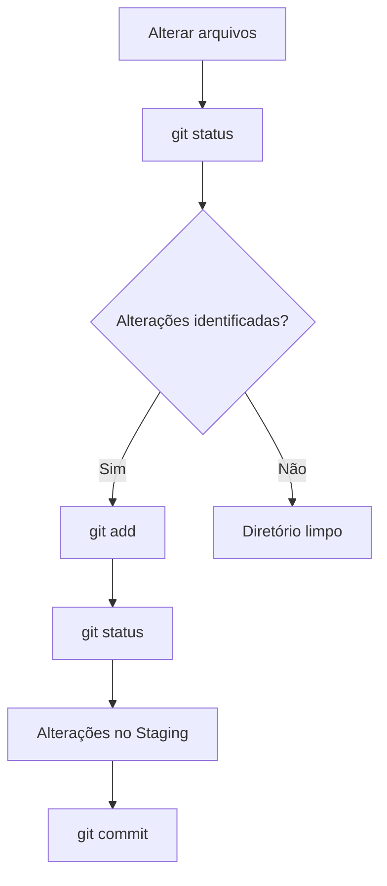

# `git status`

O comando `git status` permite **verificar o estado atual do repositório**, mostrando quais arquivos foram modificados, adicionados, removidos ou ainda não estão sendo rastreados pelo Git.

```bash
git status
```

## O que o comando mostra?

Entre outras informações, o `git status` pode indicar:

* **Arquivos modificados** — arquivos que foram alterados desde o último `commit`.
* **Arquivos não rastreados** — arquivos novos que ainda não foram adicionados ao Git.
* **Arquivos no staging** — alterações que já foram adicionadas com `git add` e estão prontas para o próximo `commit`.
* **Arquivos removidos** — arquivos que foram excluídos.

## Exemplo

```text
On branch main

Changes not staged for commit:
  modified:   README.md

Untracked files:
  index.html
```

Nesse exemplo:

* `README.md` foi modificado, mas ainda não passou pelo `git add`.
* `index.html` é um arquivo novo que o Git ainda não está rastreando.

Depois de executar:

```bash
git add .
```

podemos verificar novamente:

```bash
git status
```

Agora as alterações estarão no **staging**, prontas para serem registradas com:

```bash
git commit -m "Atualiza projeto"
```

### Fluxo



> **Resumo:** use `git status` frequentemente para saber **o que mudou no seu projeto e em que etapa do fluxo do Git cada alteração está**.
