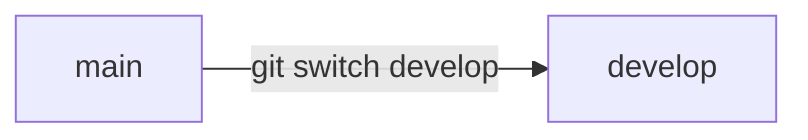
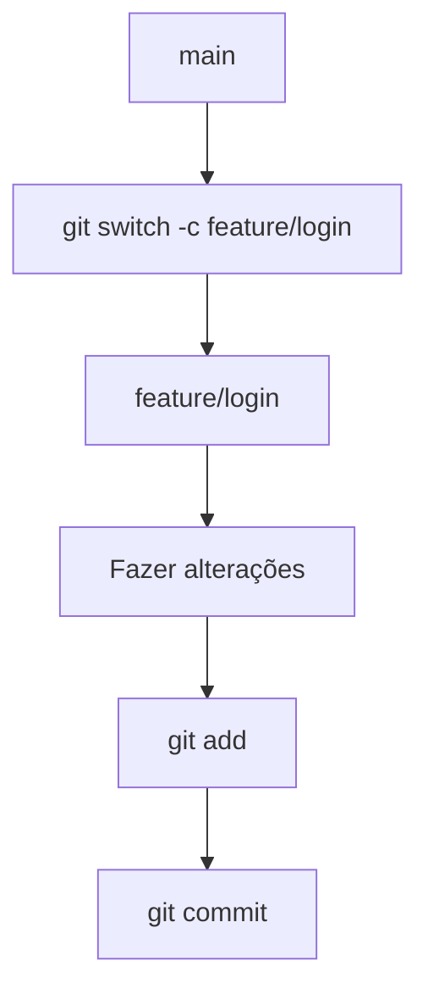
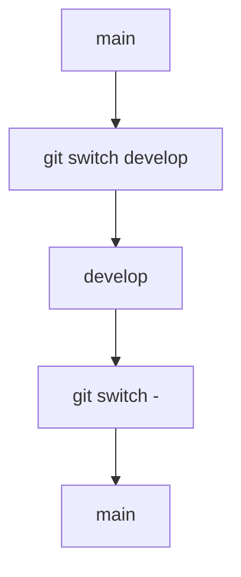
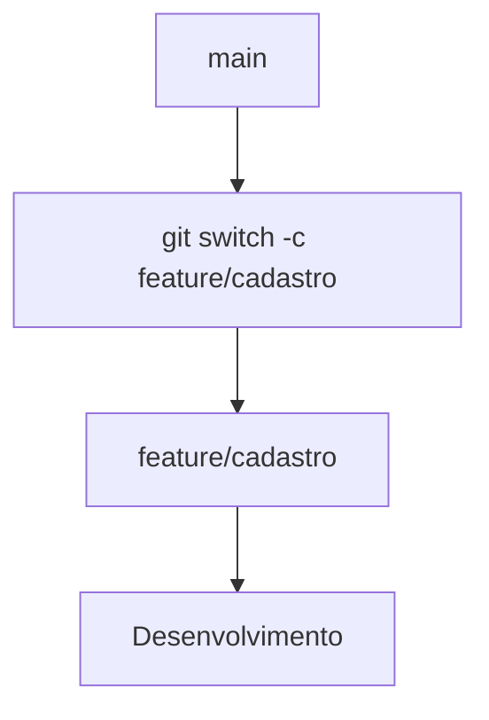
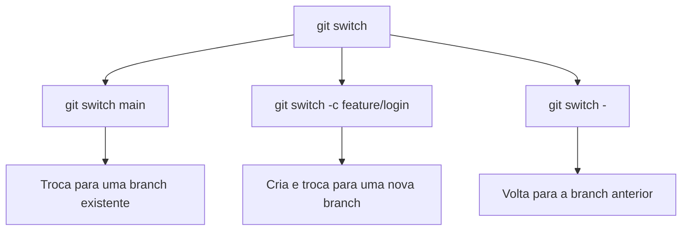

# `git switch`

O comando `git switch` é utilizado para **trocar de branch** e, diferentemente do antigo `git checkout`, possui uma finalidade mais específica: trabalhar com branches.

Ele foi introduzido no Git para tornar mais claro o que o comando está fazendo.

## 1. Verificar as branches existentes

Antes de trocar de branch, você pode listar as branches:

```bash
git branch
```

Exemplo:

```text
* main
  develop
  feature/login
```

O `*` indica a branch em que você está atualmente.

---

## 2. Trocar de branch

Para mudar para uma branch existente:

```bash
git switch develop
```

Agora você estará trabalhando na branch `develop`.



---

## 3. Criar uma nova branch

Para **criar uma nova branch e já mudar para ela**, utilize:

```bash
git switch -c feature/login
```

O `-c` significa **create**.

É equivalente ao antigo:

```bash
git checkout -b feature/login
```

O fluxo fica:



---

## 4. Voltar para a branch anterior

Você também pode voltar rapidamente para a branch em que estava anteriormente:

```bash
git switch -
```

Por exemplo:



---

## 5. Criar uma branch a partir de outra

Imagine que você está na `main`:

```bash
git switch main
```

E quer criar uma branch para desenvolver uma nova funcionalidade:

```bash
git switch -c feature/cadastro
```

A nova branch será criada **a partir do estado atual da `main`**.



## `git switch` × `git checkout`

O `git checkout` possui várias responsabilidades. O `git switch` foi criado especificamente para tornar as operações com branches mais claras.

| Ação                     | `checkout`                | `switch`                     |
| ------------------------ | ------------------------- | ---------------------------- |
| Trocar de branch         | `git checkout main`       | `git switch main`            |
| Criar e trocar de branch | `git checkout -b feature` | `git switch -c feature`      |
| Restaurar arquivo        | `git checkout -- arquivo` | ❌                            |
| Acessar commit           | `git checkout <hash>`     | `git switch --detach <hash>` |

Para restaurar arquivos, atualmente prefira:

```bash
git restore arquivo.txt
```

### Resumo



> **Resumo:** `git switch` é o comando moderno e mais específico para **criar e trocar de branches**.
